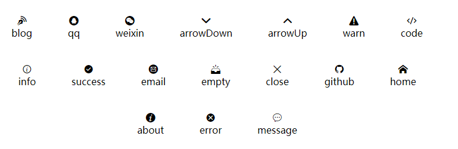

## Avatar 头像组件

| 属性名 | 说明               | 类型   | 是否必填 | 默认值 |
| :----- | :----------------- | :----- | :------- | :----- |
| url    | 头像地址           | String | 是       | 无     |
| size   | 头像尺寸，宽高相等 | Number | 否       | 150    |

## Icon 图标组件

| 属性名 | 说明     | 类型   | 是否必填 | 默认值 |
| :----- | :------- | :----- | :------- | :----- |
| type   | 图标类型 | String | 是       | 无     |

## Pager 翻页组件

该组件会撑满父容器

| 属性名     | 说明                   | 类型   | 是否必填 | 默认值 |
| :--------- | :--------------------- | :----- | :------- | :----- |
| current    | 当前页码               | Number | 否       | 1      |
| total      | 总数据量               | Number | 否       | 0      |
| limit      | 页容量                 | Number | 否       | 10     |
| showNumber | 可见的最大数字页码数量 | Number | 否       | 5      |

| 事件名     | 说明         | 事件参数 | 参数说明 | 参数类型 |
| ---------- | ------------ | -------- | -------- | -------- |
| changePage | 用于改变页码 | newPage  | 新页码   | Number   |

## Empty 组件

该组件会在父容器中水平垂直居中

| 属性名 | 说明         | 类型   | 是否必填 | 默认值 |
| :----- | :----------- | :----- | :------- | :----- |
| title  | 图标标题文字 | String | 否       | 无数据 |

## ImageLoader 组件

这个组件可以实现一个渐进式的图片

| 属性名      | 说明                         | 类型   | 是否必填 | 默认值 |
| :---------- | :--------------------------- | :----- | :------- | :----- |
| url         | 原图地址                     | String | 是       | 无     |
| placeholder | 占位图片地址                 | String | 是       | 无     |
| duration    | 占位图切换到原图经历的毫秒数 | Number | 否       | 500    |

| 事件名 | 说明               | 参数 |
| ------ | ------------------ | ---- |
| loaded | 切换原图完成后触发 | 无   |

## Aside 组件

网站的侧边栏，宽度和高度会撑满容器

**Contact 组件**

联系人组件，该组件会横向撑满容器，背景色透明

**Menu 组件**

导航组件，该组件会横向撑满容器，背景色透明

## Layout 组件

该组件可以实现左、中、右三栏布局，会撑满父容器

| 插槽名称 | 说明       |
| :------- | :--------- |
| left     | 左侧区域   |
| default  | 中间主区域 |
| right    | 右侧区域   |
